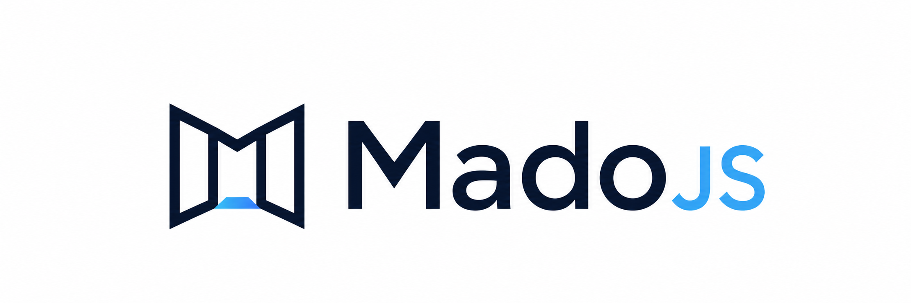

<div align="center">
  

  <p>
    <strong>A calm native-first web framework for sites and apps.</strong>
  </p>

  <p>
    Web Components · Signals · Browser-rendered static snapshots · Zero runtime dependencies
  </p>
</div>


# Mado

> A calm native-first web framework for sites and apps.

[](https://www.npmjs.com/package/@madojs/mado)
[](https://github.com/madojs/mado/actions/workflows/ci.yml)
[](./LICENSE)
[](https://www.paypal.com/paypalme/tsekhmister)

[Website](https://madojs.dev) ·
[Documentation](./docs/en/README.md) ·
[Mado UI](https://ui.madojs.dev)

Build with real Web Components, signals, routing, data and forms.
Ship live SPAs and browser-rendered static documents from one
component model.

**One component model. One page model. One release command.**

Mado (`窓`) means *window* in Japanese: a calm window into your app,
without dragging a whole frontend factory into the room.

## What you get

```txt
Mado component = Custom Element + open Shadow DOM
Mado page      = route + load + head + view + optional static declaration
Mado release   = Vite build
               + browser-rendered static documents
               + Declarative Shadow DOM
               + SPA fallback
               + deployment artifact

Client activation = atomic takeover
                  ≠ hydration
                  ≠ SSR reconciliation
```

Browser-native source, with Vite as the development and delivery
transport. No framework-specific compiler and zero runtime
dependencies.

## Use cases

- Public landing pages
- Documentation sites
- Product / catalog pages
- SaaS applications
- Business applications
- Admin panels and internal tools
- Dashboards
- Embedded widgets

## Quick start

Requires Node.js 22.12 or newer.

```bash
npm exec --yes --package @madojs/mado@latest -- mado init my-app
cd my-app
npm install
npm run dev
```

The default starter is the universal starter: ~15 source files,
runnable without a backend, demonstrating one Shadow Component shared
between a static landing page and a live SPA route.

Evaluating a larger business frontend with an auth shell, guarded zones and
explicit module boundaries? The optional modular experiment is available:

```bash
npm exec --yes --package @madojs/mado@latest -- \
  mado init my-app --starter modular
```

## The Mado way

### Signals — reactive state

```ts
import { signal, computed, effect } from "@madojs/mado";

const count = signal(0);
const doubled = computed(() => count() * 2);
effect(() => console.log(count()));

count.set(1);
```

### Templates — tagged template html

```ts
html`<button @click=${fn} ?disabled=${loading} class=${cls}>${label}</button>`;
```

- `${value}` — child content (text, nodes, arrays, nested `html`, `each`)
- `@event=${fn}` — event listener
- `attr=${v}` — attribute
- `.prop=${v}` — DOM property
- `?attr=${flag}` — boolean attribute
- Functions and signals are tracked reactively

### Components — real Web Components

```ts
import { component, css, html } from "@madojs/mado";

component(
  "x-card",
  () => html`<section><slot></slot></section>`,
  {
    styles: css`:host { display: block; padding: 1rem; }`,
  },
);
```

Open shadow root, scoped styles, slots, attribute reactivity, a real
custom element under the hood. The same component renders inside the
static snapshot via Declarative Shadow DOM and inside the live SPA via
direct DOM attachment.

### Pages — `route + load + head + view`

```ts
import { html, page } from "@madojs/mado";

export default page({
  static: true,                                  // capture as HTML at release
  title: "Mado Keyboard",
  head: () => ({ description: "A canonical product page." }),
  view: () => html`<h1>Welcome</h1>`,
});
```

### Routing — explicit, code-split

```ts
import { routes, routeUrl } from "@madojs/mado";

export default routes({
  "/":            () => import("./pages/home.page"),
  "/users/:id":   () => import("./pages/user.page"),
  "*":            () => import("./pages/not-found.page"),
});

// Internal links must be base-aware.
html`<a data-link href=${routeUrl("/users/42")}>User</a>`;
```

Use `data-link` for normal SPA navigation. A destination that requires a new
CSP/COOP/auth document realm still uses `routeUrl()` but omits `data-link` so
the browser performs a full document request.

Lazy loading, layout groups, query params, guards, hover prefetch,
per-entry scroll restoration, commit-aware fragment links, error boundary,
View Transitions, base-path awareness (Vite `base` → runtime
`import.meta.env.BASE_URL`). Reactive
`queryParam()` values follow programmatic navigation, `data-link` and browser
history changes.

### Data — resource + mutation

```ts
import { resource, mutation, jsonFetcher } from "@madojs/mado";

const user = resource(
  () => `/api/users/${userId()}`,
  jsonFetcher<User>(),
  { staleTime: 60_000 },
);

const save = mutation((user, signal) => api.saveUser(user, { signal }), {
  invalidates: ["/api/users*"],
});
```

Cache, loading/error state, abort, refresh, optimistic `mutate()`,
glob-based invalidation. Resources and mutations created by pages/components
are lifecycle-owned; standalone instances expose idempotent `dispose()`.

### Forms — browser constraint validation

```ts
import { useForm, html } from "@madojs/mado";

const form = useForm({
  initial: { email: "", age: "" as number | "" },
});

html`<form @submit=${form.onSubmit(save)}>
  <input name="email" type="email" required @input=${form.onInput} />
  <input name="age" type="number" min="18" @input=${form.onInput} />
  <button type="submit">Save</button>
</form>`;
```

HTML owns constraints and keyboard/form semantics; Mado supplies typed values,
errors, touched/dirty state and abortable async validation. Applications can
normalize authoritative server validation into `form.setErrors()` without
coupling Mado to a backend response format.

### Static snapshots — SEO without SSR

```bash
mado release
```

`mado release` runs your app in a real Chromium and freezes the
rendered HTML — including the Shadow DOM via Declarative Shadow DOM —
into one file per route. On first paint Mado atomically replaces the
static tree with the live tree: no hydration protocol, no node
reconciliation, no per-attribute diffing.

- Real search engines see a fully rendered document.
- Social preview bots see the canonical / og tags inside the raw HTML.
- Same-origin assets and module preloads remain base-relative and portable.
- JS-disabled browsers see meaningful content.
- The live app boots from the same snapshot without re-fetching seeded
  data.

## CLI

```bash
mado init my-app                  # scaffold universal starter
mado init my-app --starter modular  # scaffold optional modular experiment
mado dev                          # Vite dev server
mado build                        # Vite production SPA build
mado typecheck                    # tsc --noEmit
mado static [--base-url …]        # low-level snapshot only
mado release                      # vite build + snapshots + deployment files
mado preview                      # serve out/ like a real static host
mado new <kind> <path>            # scaffold canonical files
```

All CLI records share `level`, `scope`, `code`, `message`, `data` and a
timestamp. Use `--log-level`, `--log-format=pretty|plain|json`,
`MADO_LOG_LEVEL`, `MADO_LOG_FORMAT` or `NO_COLOR` for automation.

## Devtools

```ts
if (import.meta.env.DEV) {
  const { devtools } = await import("@madojs/mado/devtools.js");
  devtools.open();
}
```

The development-only Shadow DOM overlay is toggled with `Alt+Shift+M` and
inspects reactivity, components, routing, data and structured diagnostics.
Load its public subpath only in development so the overlay itself does not
become part of the production application.

## UI without a runtime dependency

[`@madojs/ui`](https://ui.madojs.dev) is a separate development CLI and
versioned source registry. Its live catalog documents the source,
dependencies, accessibility and fallback contract for each reviewed
foundation, component, block and template. The CLI copies selected source into
the application; the application owns the resulting files.

```bash
npx @madojs/ui@latest init
npx @madojs/ui@latest list
npx @madojs/ui@latest add button field panel
npx @madojs/ui@latest remove panel --dry-run
```

Applications never import `@madojs/ui` in browser code. `mado new component`
creates a minimal application-owned component skeleton; `mado-ui add` resolves
reviewed registry source and its dependencies. Lock format 2 records explicit
installation roots and their dependency edges so updates and removals do not
guess ownership. Legacy format-1 locks require an explicit
`mado-ui migrate <explicit-item...>`; use the dry run first and never infer the
roots. See [the Mado UI guide](./docs/en/17-mado-ui.md) or the
[registry source](https://github.com/madojs/ui).

## Honest boundaries

- No server renderer.
- No hydration protocol.
- No framework compiler.
- No runtime dependencies.
- No built-in backend.
- No bundled UI runtime. Mado UI provides a focused, copy-owned official
  registry; the broader third-party ecosystem is still early.
- Modern evergreen browsers only.
- A compatible Chromium is required at release time for static routes.
- Static `paths()` and `initialData()` callbacks must be browser-safe
  and secret-free (they run during discovery AND ship in the client
  bundle).

## Why teams pick Mado

| What matters to you | Best choice |
|---|---|
| Existing team, vendor integration or hiring constraint points there | React or Vue |
| Reusable design-system components across host frameworks | Lit |
| Compiled JSX or component-language workflow | Solid or Svelte |
| Progressive enhancement of server-rendered pages | htmx + your backend |
| One component model for sites and apps with calm maintenance | **Mado** |

## Production

```bash
mado release    # typecheck + vite build + static snapshots + deployment files
mado preview    # serve out/ like a real static host
```

One command, one artifact (`out/`). Upload it to a static host after applying
the host-specific routing policy for static, SPA or hybrid routes; see
[Deployment](./docs/en/20-deployment.md).

## Documentation

Canonical docs (English) live in [`docs/en/`](./docs/en/README.md).

Build tools can resolve the same ordered source set from the published
`@madojs/mado/docs/en/manifest.json` asset. The compact framework contract is
also published as `@madojs/mado/llms.txt`, and the exact package identity and
version are available through `@madojs/mado/package.json`.

AI-agent entrypoints: [AGENTS.md](./AGENTS.md) · [llms.txt](./llms.txt)

## Tests

```bash
npm run typecheck
npm run build
npm test
npm run size
npm run package:smoke
```

The full snapshot + takeover round-trip and the base-path contract
are required CI gates (`.github/workflows/ci.yml → static-snapshot`),
run under a pinned Playwright-managed Chromium with
`MADO_REQUIRE_BROWSER=1` so they never silently skip on PRs.

## Contributing

Read [CONTRIBUTING.md](./CONTRIBUTING.md). Bug fixes with tests, docs
improvements, examples and carefully discussed core changes are
welcome. Runtime dependencies are not.

## License

MIT.
